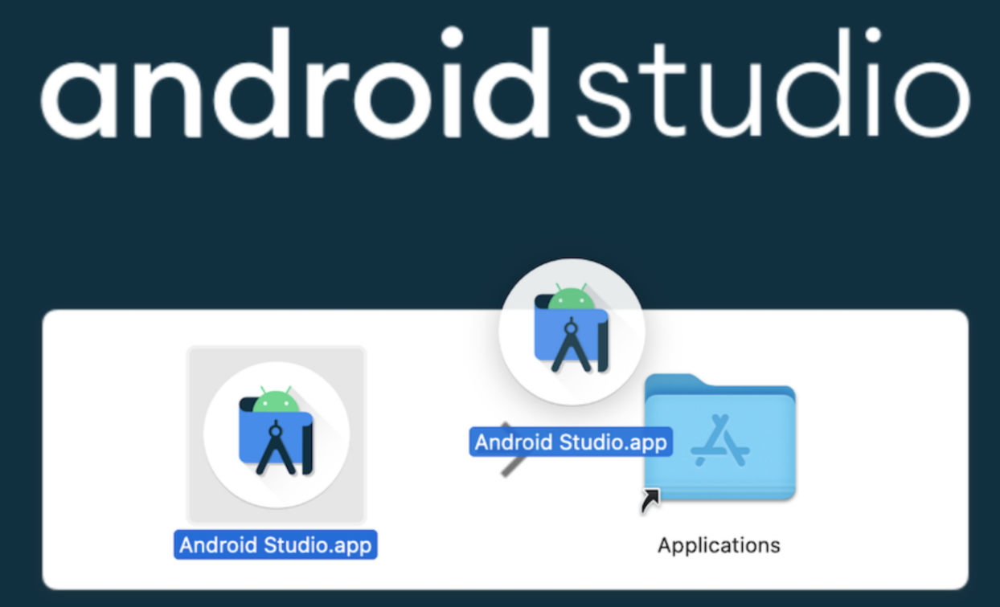
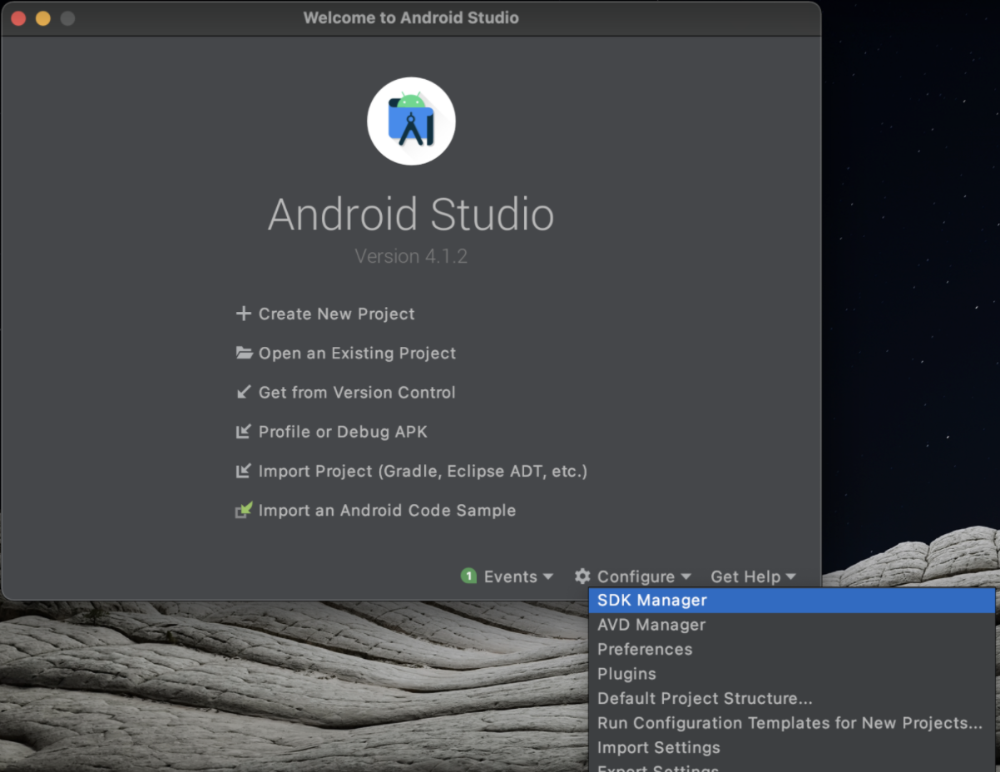
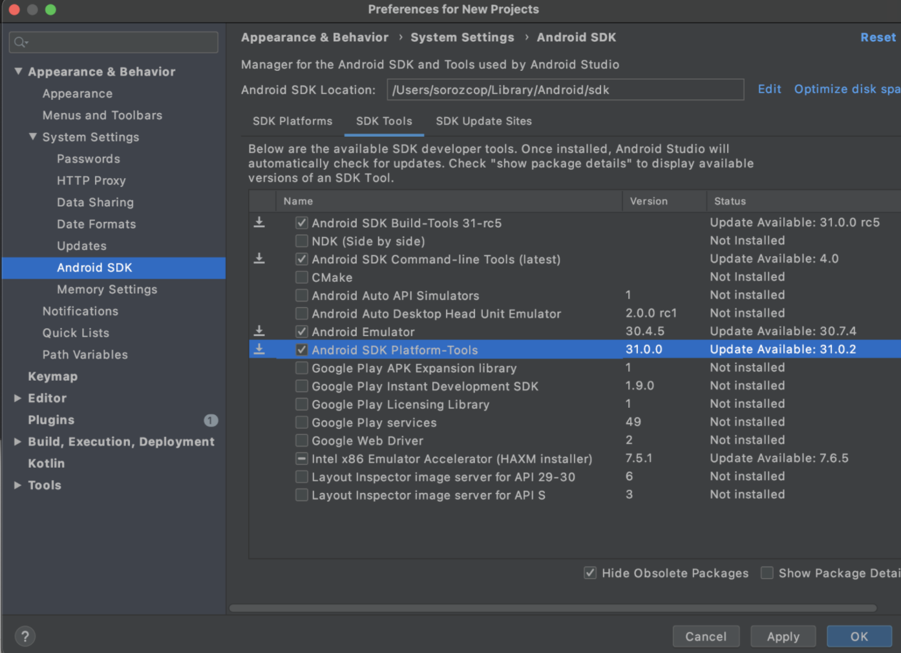
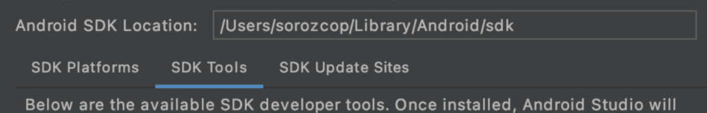
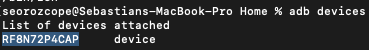

# Android SDK Setup

## Installing Android SDK 

1. Download the installation package for [Android Studio on its official page](https://developer.android.com/studio)

2. Open the ```.dmg``` file

3. Drag the installer and drop it on Applications folder
   

4. Download required tools
   1. Open the Android Studio app
   2. Go to SDK manager
      

   3. Ensure you have selected the Build-tools, Command-line tools, Emulator, and Platform-tools.
      

   4. Click on **Apply**, then click on **Ok** button
   5. Accept and install each listed package. (it would take a while)

## Configure your ANDROID_HOME environment variables

1. Open the Android Studio app

2. Go to SDK manager
   

3. Copy the path from **Android SDK Location** field
   

4. Open your [source file for environment variables](TerminalResourceFile.md), then add the following lines (change the path to the one shown on step 3):
   ```
   export ANDROID_HOME="/Users/sorozcop/Library/Android/sdk"

   export PATH=$PATH:$ANDROID_HOME/platform-tools
   export PATH=$PATH:$ANDROID_HOME/tools
   export PATH=$PATH:$ANDROID_HOME/build-tools
   export PATH=$PATH:$ANDROID_HOME/emulator
   ```
5. Close all terminal and command lines.

6. Plug an Android device which is turned on the debug via usb on developer options (You can search how to do it on google, each device model has its own way to do it)

7. Open a new terminal and run the command adb devices it must show your connected device as follows.
   
