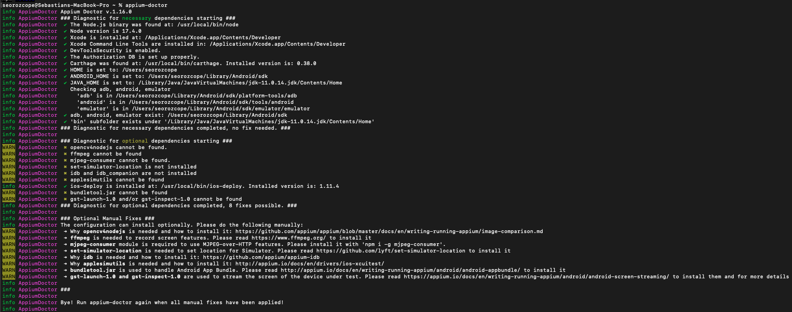

# (Optional) Appium doctor

1. open a terminal

2. Run the command ```npm install appium-doctor -g```

3. Once installed, verify your appium installation using ```appium-doctor```, it will show you if everything is ready up to use appium.

   
