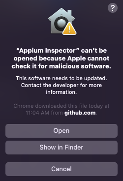

# Appium Inspector

You can install the latest release of appium inspector following the [latest stable release available](https://github.com/appium/appium-inspector/releases)

You can follow the official installation guide on [Appium inspector documentation](https://github.com/appium/appium-inspector)

1. Go to [latest stable release available](https://github.com/appium/appium-inspector/releases)

2. Download the latest stable release (use the specific installer for your OS), just download the ```.dmg``` file for Mac OS.

3. Open the ```.dmg``` file

4. Drag the file to applications folder
   

5. Open the application for the first time
    1. it will show you a modal which says that the application is not secure
    

6. Open the Mac system preferences
   

7. Go to Security & Privacy
   

8. Go to General tab and click on **open anyway** button for Appium app
   

9. Click to Open
   

10. Ensure the application has the port 4723 and /wd/hub as remote path


