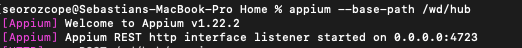
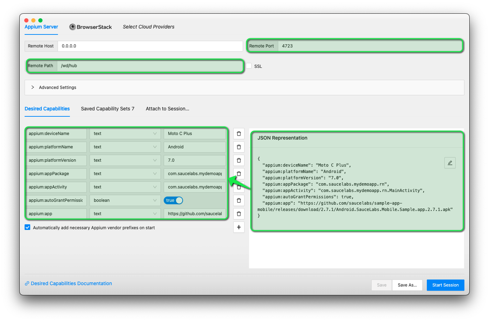
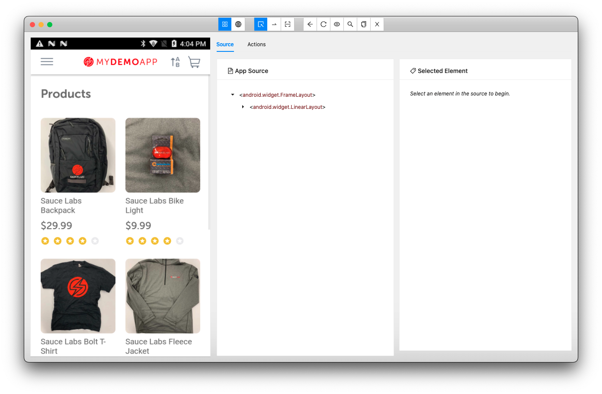

# Appium Inspector mapping session examples

First to all, run the appium server using ```appium --base-path /wd/hub```



In addition, you just need to add the device and application capabilities on appium inspector as follows:



Then, you just need to click on Start session button, and wait for the app to be initialized



##Android basic mapping session capabilities

```
{
  "appium:platformName": "Android",
  "appium:platformVersion": "9.0",
  "appium:deviceName": "85b3638553857",
  "appium:appActivity": "my.app.apActivity,
  "appium:appPackage": "my.app.package"
}
```

##iOS basic mapping session capabilities

```
{
  "platformName": "iOS",
  "platformVersion": "13.6",
  "deviceName": "iPhone XR",
  "automationName": "XCUITest",
  "bundleid": "my.app.bundleid"
}
```

## Official appium desired capabilities documentation

If you want more info about appium capabilities able to work with Android or iOS, you can follow the [Appium desired capabilities documentation](https://appium.io/docs/en/writing-running-appium/caps/)