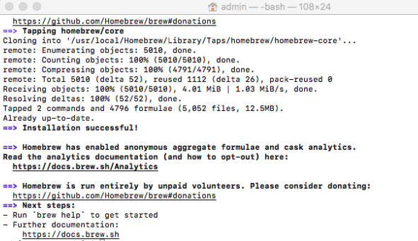

# Homebrew

Homebew is a package management tool which will allow us to install distinct dependencies and libraries to set up our testing environment. 

You can check the official command to be executed to install Homebrew on its [official web page](https://brew.sh/).

1. Open a new terminal

2. run the command

    ```
    /bin/bash -c "$(curl -fsSL https://raw.githubusercontent.com/Homebrew/install/HEAD/install.sh)"
    ```

3. Check that installation was successfully ended on your terminal
   


