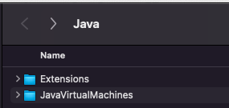
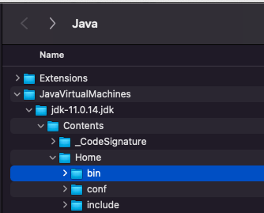
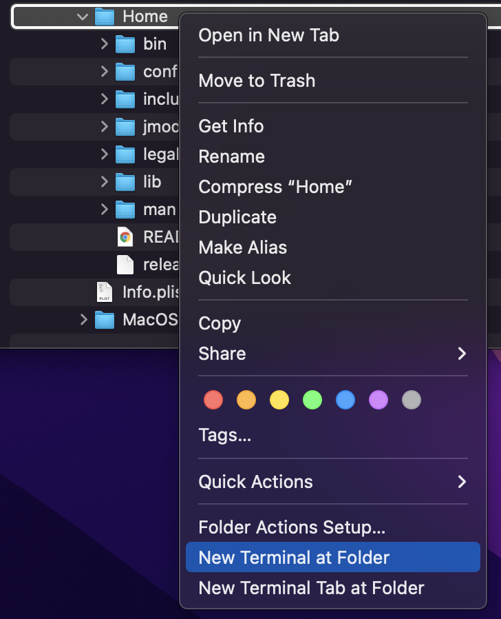
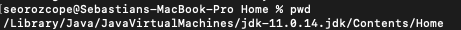

# JDK (Java Development Kit)

## Step by step - How to download and install JDK

1. You can follow this [link to download the JDK version](https://www.oracle.com/java/technologies/downloads/#java11) which is appropriate for your automation like Java 8, Java 11 or latest versions of it.

2. From either the browser **Downloads** window or from the file browser, double-click the .dmg file to start it.

   1. A **Finder** window appears that contains an icon of an open box and the name of the .pkg file.

3. Double-click the JDK.pkg icon to start the installation application.

   1. The installation application displays the **Introduction** window.

4. Click **Continue**.

   1. The **Installation Type** window appears.

5. Click **Install**.

   1. A window appears that displays the message: Installer is trying to install new software. Enter your password to allow this.

6. Enter the **Administrator credentials** then click **Install Software**.

   1. The software is installed and a confirmation window is displayed.

7. **Configure the JAVA_HOME environment variable**.


## Configure your JAVA_HOME environment variable

To ensure you’ll be working with the correct version of JVM is necessary to configure and environment variable which will be called ```JAVA_HOME```.

1. We need to find the installation folder of our JDK, to achieve it we will need to open a new terminal and execute the command ```open /Library/Java``` which is the default installation folder for the JVM.

    At this point you must be watching the following folder:
   

2. We need to navigate into the folder till we find the java bin folder
   

3. Do a right click on ```Home folder``` and select the option ```new terminal at folder```
   

4. At the terminal execute the command ```pwd``` it will show the installation path of our JVM.
   

5. Open your [source file for environment variables](TerminalResourceFile.md) and add the following lines (change the path to the one shown on step 4):
   ```
   export JAVA_HOME="/Library/Java/JavaVirtualMachines/jdk-11.0.14.jdk/Contents/Home"
   export PATH=$PATH:$JAVA_HOME/bin
   ```
6. Close all terminal which are currently running.
7. Open a new terminal and execute the command ```java --version``` , the response must show the java version you just installed.
   e.g.
   ```
   java 11.0.14 2022-01-18 LTS
   Java(TM) SE Runtime Environment 18.9 (build 11.0.14+8-LTS-263)
   Java HotSpot(TM) 64-Bit Server VM 18.9 (build 11.0.14+8-LTS-263, mixed mode)
   ```

